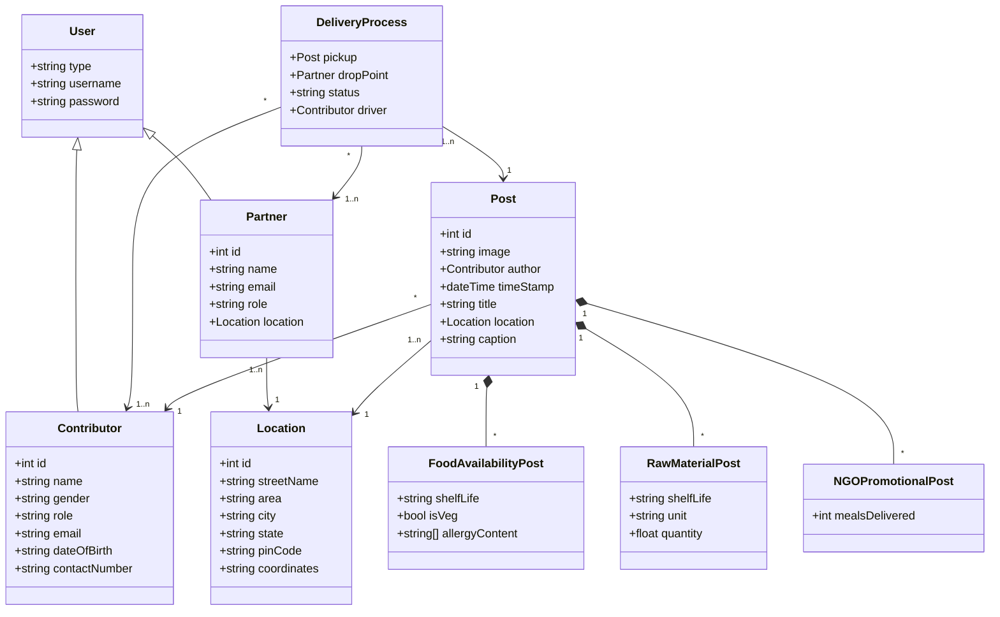

# ShareBite a project to achieve target of ZERO Hunger

Welcome to Project ShareBite, an initiative aimed at achieving the ambitious goal of ZERO Hunger worldwide. Our mission is to address food wastage issues by leveraging technology, community engagement, and sustainable solutions.

# About ShareBite

ShareBite is a collaborative platform that connects surplus food providers, volunteers, and individuals in need, creating a network where surplus food can be efficiently redistributed to those who require it the most. By harnessing the power of technology, we strive to eliminate food waste while simultaneously combating hunger in our communities.

# Our Goals

- Zero Hunger: Our primary objective is to contribute towards the global effort to eradicate hunger in all its forms by facilitating the redistribution of surplus food to those who are food insecure.

- Reduce Food Waste: ShareBite aims to minimize food waste by providing a platform for surplus food providers such as farmers, wholesalers, restaurants and grocery stores, to connect with organizations and individuals who can utilize excess food effectively.

- Community Engagement: We believe in the power of community involvement. ShareBite encourages individuals to participate actively in the fight against hunger and mass material waste by volunteering their time, resources, or expertise to support our cause.

- Sustainable Solutions: Sustainability is at the core of ShareBite's approach. We promote sustainable practices in food distribution and consumption to ensure a long-term impact on hunger alleviation and environmental conservation.

# Features of ShareBite Platform

- Surplus Food Posting by Vendors: Vendors such as restaurants can easily post surplus meals and food items on our platform. They can include details like quantity, allergic contents, shelf life, pickup location, and even add a picture to showcase the available food.
- User-Generated Food Availability Posts: Normal users who wish to support our cause can also post about meal or food availability. This feature allows individuals to contribute to our mission by sharing surplus food they have at home or in their communities.
- NGO Impact Sharing: NGOs can share stories and pictures detailing how individuals have benefited from the redistributed food. This feature helps highlight the positive impact of our initiative and encourages further participation.
- Food Pickup and Delivery by Riders: Our dedicated team of riders ensures that surplus food is picked up from the vendors' locations and delivered to nearby NGOs efficiently and safely.
- Donation of Surplus Raw Materials by Farmers: Farmers willing to donate large surplus amounts of raw materials can utilize a dedicated post section. This feature facilitates discussions between our team and the farmers to arrange donations effectively.
- Event Promotion: We occasionally organize events where we prepare meals with the ingredients donated by suppliers and cooked with the association of helpers. These events serve to engage the community, raise awareness, reduce food wastage and encourage participation in our mission to end hunger.
- Fundraising Feature: Those who cannot contribute with meals or ingredients can support financially which will be used to buy the missing inventory to prepare meals during the events, we provide a fundraising feature where individuals can donate to further our efforts in combating hunger
- Volunteer and Chef Hiring: Individuals interested in volunteering or working as riders or kitchen staff including cooks and servers can associate with us through our platform. We welcome passionate individuals to join our team and contribute to our cause.

# How to run

- Go to the AppAPI using command `cd sharebite-application/AppAPI` and install all the libraries using the command `npm i`, then run `npm start`. This will start the backend of the application.
- To start the frontend run command `cd sharebite-application/AppUI/sharebite` and install all the libraries using the command `npm i`, then run `npm start` to start the frontend of the application.

Note: The .env files are not uploaded for security reasons. Connect with one of the team members to get the info on .env file.

## Sharebite Team Members

- Shreyas Kothari (kothari.shr@northeastern.edu)
- Amit Singh Tomar (tomar.am@northeastern.edu)
- Aniket Vaman Navale (navale.an@northeastern.edu) 
- Mohit Jain (jain.mohi@northeastern.edu)

## Object Model

