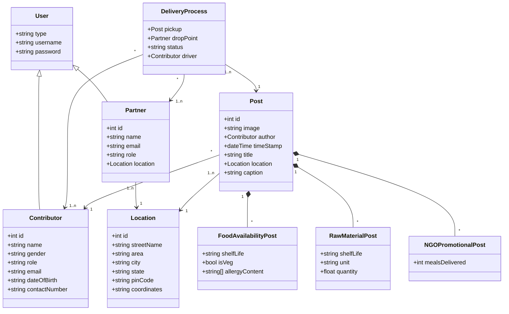

# Object Model

```mermaid

---
Object Model for Sharebite project
---

classDiagram
    class Location{
        +int id
        +string streetName
        +string area
        +string city
        +string state
        +string pinCode
        +string coordinates
    }

    class User{
        +string type
        +string username
        +string password
    }

    class Contributor{
        +int id
        +string name
        +string gender
        +string role
        +string email
        +string dateOfBirth
        +string contactNumber
    } 

    class Partner{
        +int id
        +string name
        +string email
        +string role
        +Location location 
    }

    class Post{
        +int id
        +string image
        +Contributor author
        +dateTime timeStamp
        +string title
        +Location location
        +string caption
    }

    class FoodAvailabilityPost{
        +string shelfLife
        +bool isVeg
        +string[] allergyContent
    }

    class RawMaterialPost{
        +string shelfLife
        +string unit
        +float quantity
    }

    class NGOPromotionalPost{
        +int mealsDelivered
    }

    class DeliveryProcess{
        +Post pickup
        +Partner dropPoint
        +string status
        +Contributor driver
    }

    User <|-- Contributor
    User <|-- Partner
    Partner "1..n" --> "1" Location
    Post "1..n" --> "1" Location
    Post "1" *-- "*" FoodAvailabilityPost
    Post "1" *-- "*" RawMaterialPost
    Post "1" *-- "*" NGOPromotionalPost

    DeliveryProcess "1..n" --> "1" Post
    DeliveryProcess "*" --> "1..n" Partner
    DeliveryProcess "*" --> "1..n" Contributor
    Post "*" --> "1" Contributor

```
